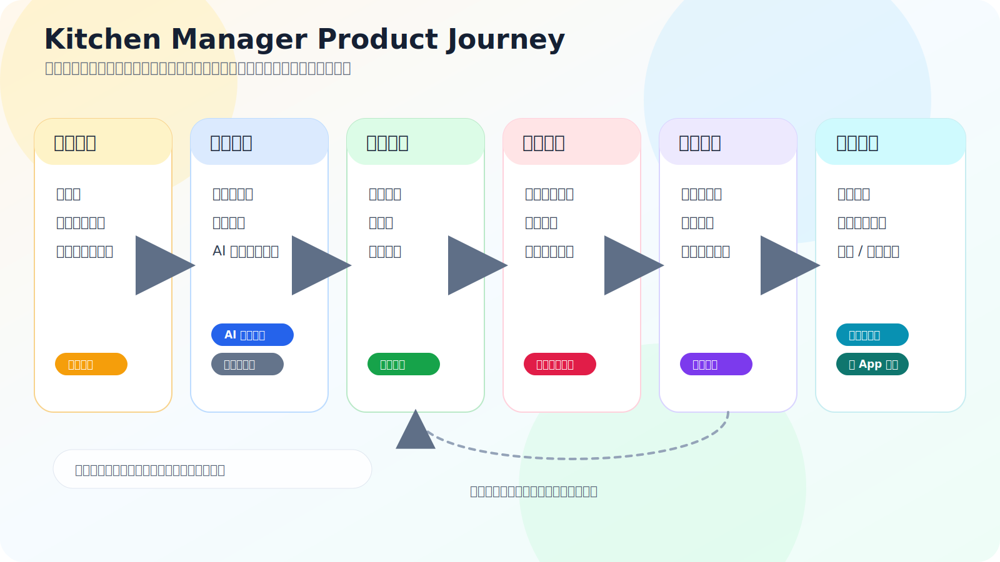
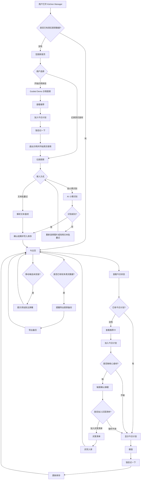
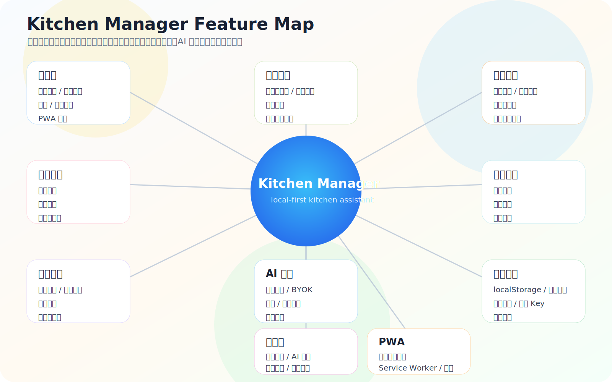
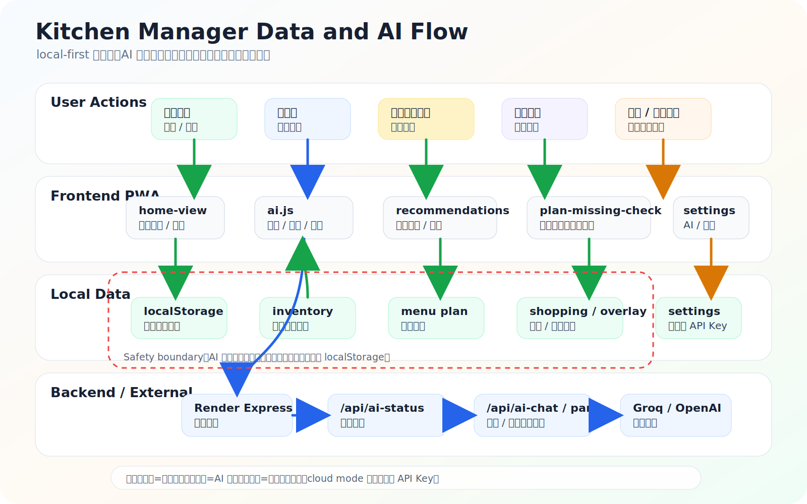
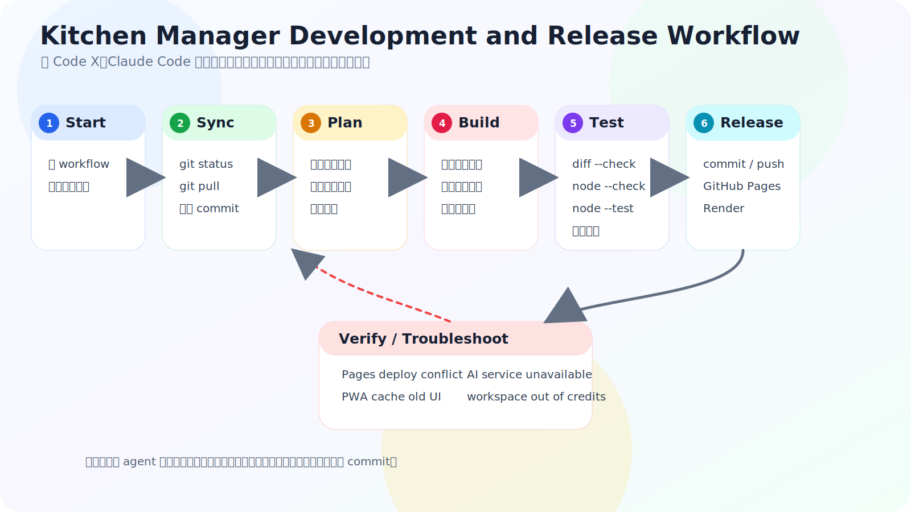
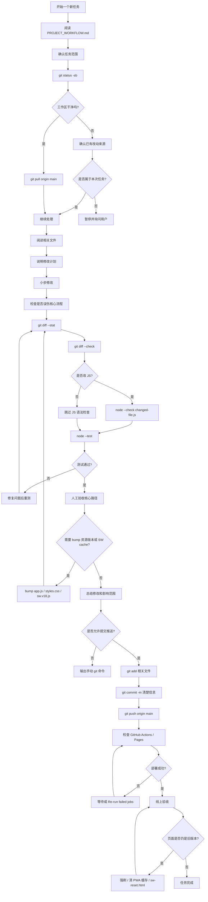

# Kitchen Manager Project Workflow

这份文档面向后续使用 Code X、Claude Code 或人工维护 Kitchen Manager 的开发者。目标是让每次迭代都能先理解产品目标、核心流程、技术结构和安全边界，再做小而可验收的修改。

## 1. Product Vision

Kitchen Manager 是一个 local-first PWA，用当前浏览器保存厨房数据，帮助用户低摩擦地完成每天做饭前后的关键判断。

它不是复杂的库存 ERP，也不是后台管理系统。它应该像一个日常厨房助手，快速回答：

- 今天吃什么？
- 家里有什么？
- 缺什么？
- 什么快过期？
- 做完后库存怎么更新？

产品体验应保持简单、可信、低摩擦。主流程要让用户自然完成“记录食材 -> 看推荐 -> 加入今日计划 -> 缺什么补到买菜 -> 做完后更新库存 -> 适时备份”这条闭环。

## 2. Core User Journeys

### 2.1 First-time User Journey

1. 空厨房首页先解释可做什么，不把用户扔进复杂表单。
2. 用户可以“开始示例体验”，用 demo kitchen 走完整流程。
3. 用户也可以记录真实食材，优先进入“记进厨房”的文本批量记或小票识别。
4. 有库存后，今日页展示状态、推荐和今日计划入口。
5. 用户从推荐加入今日计划。
6. 做完后点击“饭后记一下”，确认实际做了什么并更新库存。
7. 用户产生真实厨房数据后，首页温和提醒导出备份。

### 2.2 Daily Cooking Journey

1. 打开今日页。
2. 顶部先看今天是否已有计划、临期数量、待买数量。
3. 如果已有计划，优先显示今日计划和“饭后记一下”。
4. 如果没有计划，看“推荐先做这几道”。
5. 点击“加入今日计划”。
6. 如果缺核心食材，弹出缺菜确认。
7. 用户可选择把缺食材加入买菜清单。
8. 做完后更新库存，减少下次推荐和买菜误差。

### 2.3 Grocery and Missing Ingredient Journey

1. 推荐卡直接展示缺食材摘要，例如“只差 1 样：手工挂面”。
2. 推荐卡主按钮始终是“加入今日计划”，缺食材不应阻止计划。
3. 加入计划必须走 `addRecipeToPlanWithMissingCheck`。
4. 缺核心食材时，先加入计划，再询问是否加入买菜清单。
5. 用户确认后调用购物清单逻辑添加缺项，并尽量去重。
6. 用户取消后，今日计划保留，买菜清单不新增。

### 2.4 AI-assisted Journey

1. 默认使用内置 AI 服务，前端调用同源后端接口。
2. “记进厨房”支持小票图片识别和文本批量记。
3. 菜谱导入支持 AI 辅助整理，也支持粘贴文本兜底。
4. 小票识别失败时，应提供“重新选择图片”和“改用文本批量记”。
5. AI 菜谱导入失败时，应提供“改用粘贴文本”和“稍后再试”。
6. BYOK 是高级选项，不应默认暴露给普通用户。
7. AI 是加速器，本地记食材、买菜、计划和备份必须继续可用。

### 2.5 Data Safety Journey

1. 主要数据保存在当前浏览器的 localStorage。
2. 有真实厨房数据后，首页温和提醒导出厨房备份。
3. 导出厨房备份包含库存、今日计划、买菜清单、常备品、设置和菜谱补丁等用户数据。
4. 备份默认不包含 API Key。
5. 导入厨房备份前必须确认，避免静默覆盖。
6. 用户可以先导出当前数据，再继续导入。
7. 菜谱补丁导入导出用于单独迁移菜谱新增、编辑、删除。

### 2.6 PWA Journey

1. 移动端浏览器中，在用户已有真实使用意图后提示添加到主屏幕。
2. iOS Safari 显示“点分享按钮，再选择添加到主屏幕”的专用说明。
3. Android Chrome 通过 `beforeinstallprompt` 提供“安装”按钮。
4. standalone / installed 模式不重复提示。
5. demo mode 不显示 PWA 安装提示，避免干扰示例流程。
6. 用户关闭提示后，7 天内不再打扰。

## 3. Current Feature Map

- 今日页：核心状态页，展示今日计划、临期、待买和推荐。
- 示例厨房 / Guided Demo：用独立 demo mode 和 snapshot 让用户体验完整流程。
- 食材录入：支持真实库存录入、批量文本录入和小票识别。
- 小票识别：前端压缩图片，后端或 BYOK 调用视觉模型，结果确认后才写库存。
- 文本批量记：按行解析食材、数量和单位。
- 推荐系统：基于库存、临期、缺货、收藏、最近做过等因素推荐。
- 今日计划：保存计划菜谱，支持当天和未来日期。
- 缺菜检测：加入计划时检查核心食材，提示加入买菜清单。
- 买菜清单：支持手动添加、菜谱缺货添加、已买入库和完成项清理。
- 饭后更新库存：根据实际做的菜或食材，确认后扣减库存。
- 菜谱详情：查看做法、核心食材、调料、加入计划、加入买菜。
- AI 服务：默认 cloud mode，经后端代理调用 OpenAI-compatible 服务。
- BYOK：高级用户可配置自己的 API Key、API URL 和模型。
- 备份恢复：完整厨房备份、导入确认、回滚保护、API Key 剔除。
- 菜谱补丁：用户新增、编辑、删除菜谱通过 overlay 保存。
- PWA 安装提示：移动端场景化提醒，支持 iOS 和 Android。
- 设置页普通 / 高级分层：普通用户默认只看常用设置、AI 状态和数据安全。
- 统一弹窗样式：核心弹窗使用统一 modal shell、按钮层级和 action footer。

## 4. Technical Architecture

### 4.1 Stack

- Plain HTML / CSS / JavaScript，无前端构建步骤。
- Node.js + Express 后端，入口为 `server.js`。
- PWA：`manifest.webmanifest` + `sw.v18.js` + `sw-register.v18.js`。
- localStorage 保存主要业务数据。
- GitHub Pages 可托管静态前端。
- Render 可运行 Express 后端，提供 AI 代理和链接抓取。
- AI 后端使用 OpenAI-compatible API，当前可配置 Groq。

### 4.2 Important Files

- `server.js`：Express 静态托管、`/api/xhs-extract`、`/api/ai-status`、`/api/ai-chat`、`/api/ai-parse`，负责后端 AI Key、模型分流和安全错误。
- `app.js`：前端初始化、路由、菜谱包加载、overlay 合并、PWA 安装监听。
- `index.html`：静态入口、主题预加载、CSS/JS 资源版本。
- `manifest.webmanifest`：PWA 名称、图标、standalone 显示模式。
- `sw.v18.js`：Service Worker cache name、核心资源缓存、network-first 策略。
- `styles.css`：全站视觉系统、glass modal、今日页、推荐卡、设置页、移动端样式。
- `src/storage.js`：localStorage key 常量和读写 helper。不要随意改 key。
- `src/ai.js`：前端 AI 配置、cloud/BYOK 分流、错误格式、小票与菜谱结果校验。
- `src/views/home-view.js`：今日页、推荐卡、记进厨房、demo、备份提醒、PWA 提示、饭后记一下。
- `src/views/settings-view.js`：常用设置、AI 服务状态、数据安全、高级设置、备份导入确认。
- `src/recommendations.js`：推荐核心逻辑、库存覆盖分析、缺食材分析、加入购物清单 helper。
- `src/components/plan-missing-check.js`：统一“加入今日计划并处理缺食材”的入口。
- `src/components/menu-plan.js`：今日/未来计划展示、做完计划、备菜提醒。
- `src/components/recipe-quick-modal.js`：快速菜谱弹窗和加入今日计划入口。
- `src/views/recipe-detail-view.js`：菜谱详情页、计划按钮、缺食材加入买菜。
- `test/`：Node test 覆盖推荐、缺菜、AI、备份、PWA、设置页、弹窗、今日页层级等。

### 4.3 Data Model and Storage

主要数据在 localStorage，核心 key 定义在 `src/storage.js` 的 `S.keys`。

开发规则：

- 不要随便改已有 key 名。
- 不要用 `localStorage.clear()` 作为业务逻辑。
- 不要静默覆盖用户数据。
- API Key 不应进入备份。
- 导入备份要先验证，再确认，再写入。
- demo mode 使用独立 snapshot / restore 逻辑，退出 demo 后恢复用户真实数据。
- 迁移逻辑应走 `src/migrations.js`，不能在视图里散落临时迁移代码。

### 4.4 AI Architecture

- 默认 cloud mode：前端调用 `/api/ai-chat` 或 `/api/ai-parse`。
- 后端从环境变量读取 `OPENAI_API_KEY`、`OPENAI_BASE_URL`、`OPENAI_MODEL`、`OPENAI_VISION_MODEL`。
- 前端不应暴露后端 `OPENAI_API_KEY`，也不应记录 Authorization。
- 文本任务使用 `OPENAI_MODEL`。
- 图片任务使用 `OPENAI_VISION_MODEL`。
- BYOK 是高级模式，用户 Key 只保存在本机浏览器，不进入备份。
- 小票识别失败必须给兜底入口，不能只显示“云端服务不可用”。
- 错误可保留安全的 `status`、`code`、`upstreamStatus`、`upstreamCode`，但不能泄露 Key、Authorization、base64 图片或完整 prompt。

## 5. Development Rules

### 5.1 Do Not Rewrite

- 不要重写整个项目。
- 不要迁移到框架。
- 不要引入新依赖，除非非常必要。
- 不要大范围重构核心逻辑。
- 不要把一次 UI 调整变成功能重写。

### 5.2 Keep Changes Small

- 每次只解决一个主题。
- UI 改 UI，逻辑改逻辑，不要混在一起。
- 优先复用已有函数、class、组件和测试模式。
- 每次修改后说明影响范围。
- 版本 bump 只在资源缓存需要时做。

### 5.3 Protect Core Flows

任何修改都不能破坏：

- 空厨房引导。
- Guided Demo。
- 真实食材录入。
- 推荐。
- 加入今日计划。
- 缺菜确认。
- 买菜清单。
- 饭后记一下。
- AI 小票失败兜底。
- 备份导入确认。
- PWA 安装提示。
- 设置页高级选项。

### 5.4 Avoid Dangerous Changes

禁止：

- 提交 API Key。
- 在前端硬编码后端 AI Key。
- 把 API Key 写入备份。
- 用 `localStorage.clear()` 清业务数据。
- 静默覆盖用户数据。
- 直接跳过缺菜检测加入今日计划。
- 让用户可见入口直接调用 `addRecipeToPlan`，必须走 `addRecipeToPlanWithMissingCheck`。
- 未测试就 push。

## 6. Coding Agent Workflow

### 6.1 Before Coding

每次开始任务前：

1. 运行 `git status -sb`。
2. 如果工作区干净，运行 `git pull origin main`。
3. 阅读 `PROJECT_WORKFLOW.md`。
4. 阅读和本任务相关的文件。
5. 简短说明计划。
6. 明确本次不改哪些东西。

### 6.2 During Coding

- 小步修改。
- 复用已有 class 和组件。
- 不复制粘贴重复逻辑。
- 不改无关文件。
- 移动端优先。
- 深色 / 浅色都要可读。
- 不泄露 secrets。
- 任何用户可见“加入今日计划”入口都必须保留缺菜检测。
- 弹窗和失败状态要给用户下一步。

### 6.3 After Coding

必须：

1. 运行 `git diff --stat`。
2. 运行 `git diff --check`。
3. 运行 `node --test`，除非任务明确是纯文档且说明不运行原因。
4. 如果改了单个 JS 文件，运行 `node --check path/to/file.js`。
5. 检查是否需要 bump `app.js`、`styles.css`、`sw.v18.js` cache。
6. 输出修改文件和影响范围。
7. 说明是否改了业务逻辑、数据结构、AI、备份、推荐。
8. 只有在用户明确同意或任务要求时 commit / push。

### 6.4 If Agent Cannot Push

如果 Code X / Claude Code 因权限、网络或 credits 不能 push：

- 不要绕过限制。
- 输出用户需要手动执行的命令。
- 明确列出已修改文件。
- 明确说明测试是否通过。
- 用户可以手动执行 `git add`、`git commit`、`git push`。

## 7. Testing and Validation Workflow

### 7.1 Automated Checks

标准命令：

```bash
git diff --check
node --test
node --check path/to/changed-file.js
```

纯文档任务至少运行 `git diff --check`。如果没有改业务代码，可以不跑完整 `node --test`，但最终回复必须说明原因。

### 7.2 Manual Validation Checklist

Today page：

- 空厨房首页仍引导示例体验或记录食材。
- 示例厨房 banner 可见，demo 可推进。
- 真实库存下顶部状态清楚。
- 有今日计划时优先展示计划和“饭后记一下”。
- 缺食材推荐仍显示缺什么，并能加入计划。

Modals：

- “记进厨房”拍小票和文本批量记 tab 正常。
- 缺菜确认弹窗有缺项列表、“暂时不用”和“加入买菜清单”。
- 小票识别失败有“重新选择图片”和“改用文本批量记”。
- AI 导入失败有“改用粘贴文本”和“稍后再试”。
- 备份导入前出现确认，可取消、先导出、继续导入。
- 饭后记一下可选择计划菜或库存食材，并能更新库存。

Settings：

- 默认设置页不技术化。
- AI 服务状态区域可测试 `/api/ai-status`。
- 高级设置默认折叠。
- BYOK 展开后可见 API Key、API URL、模型字段。
- 数据备份说明清楚，明确默认不包含 API Key。

PWA：

- 桌面端不显示移动端安装提示。
- iOS Safari 显示分享 / 添加到主屏幕提示。
- standalone 模式不提示。
- Android Chrome 支持时显示 install prompt。

AI：

- cloud mode 不暴露 API Key。
- BYOK 仍可用。
- 小票失败有兜底。
- 413 / 429 / 503 有可理解提示。

Backup：

- 可导出厨房备份。
- 导入前有确认。
- 备份默认不包含 API Key。
- 菜谱补丁可导入导出。

## 8. Release Workflow

1. 确认 `git status -sb` 干净或只包含本次相关修改。
2. 运行自动测试。
3. 检查 `git diff --stat` 和关键 diff。
4. 使用清楚的 commit message，例如：
   - `Fix modal action footer backgrounds`
   - `Improve settings hierarchy`
   - `Add project workflow documentation`
5. push 到 `main`。
6. 查看 GitHub Actions / GitHub Pages 部署状态。
7. 如果 Pages deploy 报 in progress deployment，等待或 re-run failed jobs。
8. Render 如果用于后端，确认是否自动部署 latest commit，必要时手动 deploy latest commit。
9. 如果改了前端静态资源，确认是否需要资源版本和 service worker cache bump。
10. 线上验收关键路径。
11. 如果页面仍旧，强刷或清 PWA 缓存，可使用 `sw-reset.html`。

## 9. Local Development Setup

### Required Tools

- Git。
- Node.js 18 或以上。
- npm。
- GitHub CLI，推荐安装但不是必须。

### Recommended macOS Setup

```bash
brew install node
brew install gh
gh auth login
gh auth status
```

如果本机 shell 提示 `zsh: command not found: node`，先确认 Node.js 是否安装并在当前 shell 的 `PATH` 中：

```bash
node -v
npm -v
```

### Common Local Commands

```bash
git status -sb
git pull origin main
git log --oneline -5
git diff --stat
git diff --check
npm test
node --test
node --check path/to/changed-file.js
```

### Running the App Locally

当前 `package.json` 只有 `start` 和 `test` scripts。不要凭空使用不存在的 `npm run dev`。

```bash
npm install
npm start
```

默认 Express 服务由 `server.js` 启动，通常访问 `http://localhost:3000`。如果只需要静态预览，也可以用简单静态服务器，但 `/api/ai-chat`、`/api/ai-parse`、`/api/ai-status` 和 `/api/xhs-extract` 只有 Express 后端模式才可用。

## 10. Environment and Secrets

- GitHub 仓库不能提交 `.env`、API Key、Groq Key、OpenAI Key、GitHub PAT 或任何长期 token。
- Render 环境变量只放在 Render 后台，不写进前端代码、文档示例或测试 fixture。
- 前端 cloud mode 不应出现后端内置 key；cloud mode 只调用同源后端接口。
- BYOK key 是用户自己的浏览器本地配置，只能保存在 localStorage，不进入备份。
- 如果截图、聊天记录、日志或 issue 中出现 key，应立即 revoke / rotate。
- 测试和日志不能输出 `Authorization`、完整 base64 图片、完整 prompt 或完整上游响应。
- Debug AI 问题时只保留安全的 `status`、`code`、`upstreamStatus`、`upstreamCode` 和简短错误原因。

## 11. Agent Handoff Rules

### 11.1 One Agent at a Time

- 不要让 Code X 和 Claude Code 同时修改同一批文件。
- 同一时间只让一个 agent 写代码。
- 另一个 agent 可以做审查、解释、prompt 编写或风险分析，但不要并行改文件。

### 11.2 Always Sync Before Switching Agents

切换 agent 前必须：

1. 运行 `git status -sb`。
2. 如果有改动，先 commit、stash，或明确说明这些改动要保留。
3. 运行 `git pull origin main`。
4. 新 agent 先阅读 `PROJECT_WORKFLOW.md`。
5. 新 agent 先确认最近 5 个 commit：

```bash
git log --oneline -5
```

### 11.3 Handoff Summary

每次从一个 agent 切到另一个 agent，前一个 agent 应输出：

- 修改文件。
- 已完成内容。
- 未完成内容。
- 测试结果。
- 是否已 push。
- 是否需要部署。
- 是否需要清 PWA 缓存。
- 是否有风险点。

### 11.4 Do Not Duplicate Fixes

新 agent 接手后，不要重新实现已经完成的功能。先检查：

- 相关文件。
- 相关测试。
- 最近 commit。
- GitHub Actions 状态。

## 12. Troubleshooting / Common Issues

### 12.1 Node.js Not Found

场景：

```text
zsh: command not found: node
```

说明：本机没有安装 Node.js，或者当前 shell 找不到 `node`。

处理：

- macOS 可以运行 `brew install node`。
- 然后确认 `node -v` 和 `npm -v`。
- 如果 Code X 能跑测试但本机不能，说明 Code X 环境和本机终端环境不同。
- 不要因为本机没有 Node.js 就判断代码失败；要看 agent 是否已在自己的环境跑过测试。

### 12.2 Code X Workspace Is Out of Credits

场景：Code X 已完成修改和测试，但无法执行 `git add`、`git commit` 或 `git push`，提示：

```text
workspace is out of credits
```

说明：这是 Code X 环境限制，不一定是 Git 权限问题，也不是代码问题。

处理：

- Agent 不应绕过限制。
- Agent 应输出已修改文件、测试结果和用户需要手动执行的 git 命令。
- 用户可在本机项目目录中手动执行：

```bash
git status -sb
git diff --stat
git add PROJECT_WORKFLOW.md
git commit -m "Improve project workflow documentation"
git push origin main
```

### 12.3 GitHub Pages Deployment Conflict

场景：GitHub Pages deploy 失败，日志出现：

```text
deployment request failed due to in progress deployment
```

说明：上一个 GitHub Pages deployment 还没结束，新的部署撞车了。通常不是代码问题。

处理：

- 打开 GitHub Actions 或 Deployments。
- 等待旧 deployment 结束。
- 或取消仍在 running 的旧 workflow。
- 对失败的 workflow 点击 Re-run failed jobs。
- 如果 build 成功、只有 deploy 失败，优先重跑 failed jobs。

### 12.4 PWA / Service Worker Still Showing Old UI

场景：GitHub Pages 已经部署成功，但页面还是旧版本。

处理：

- 先普通刷新。
- 再强制刷新。
- 如果是 PWA standalone，关闭后重新打开。
- 必要时清站点数据。
- 可使用 `sw-reset.html`。
- 检查是否已经 bump `app.js?v=...`、`styles.css?v=...` 和 `sw.v18.js` cache name。
- 不要在没有确认缓存问题前重复改代码。

### 12.5 Render / AI Service Unavailable

场景：小票识别或 AI 菜谱导入显示 AI 暂不可用。

排查：

- 检查 `/api/ai-status`。
- 检查 Render 环境变量：
  - `OPENAI_API_KEY`
  - `OPENAI_BASE_URL`
  - `OPENAI_MODEL`
  - `OPENAI_VISION_MODEL`
- 文本任务应使用 `OPENAI_MODEL`。
- 图片任务应使用 `OPENAI_VISION_MODEL`。
- Groq / OpenAI-compatible key 不得出现在前端、GitHub 或截图中。
- 修改 Render 环境变量后，需要重新部署后端。
- 如果 key 曾经出现在截图或聊天中，应 revoke / rotate。

### 12.6 Browser Network Shows API Key

场景：浏览器 Network 里出现 `Authorization: Bearer ...`，且这个 key 是后端内置 key。

说明：这是严重问题。cloud mode 不应从前端直连 Groq / OpenAI，也不应暴露后端 key。

处理：

- 立刻停止部署或回滚。
- 检查 `src/ai.js` 的 cloud / BYOK 分流。
- cloud mode 必须调用 same-origin backend route，例如 `/api/ai-chat` 或 `/api/ai-parse`。
- BYOK 才允许使用用户自己的浏览器端 API Key。
- 已泄露的 key 必须 rotate。

### 12.7 GitHub CLI / Push Issues

场景：agent 或本机 push 失败，出现：

```text
could not read Username for 'https://github.com': Device not configured
```

处理：

- 本机环境可安装并登录 GitHub CLI：

```bash
brew install gh
gh auth login
gh auth status
```

- 如果是云端 agent，不会自动继承本机 GitHub 登录。
- 云端 agent 需要 GitHub integration 或专门的 token / secrets。
- 不要把 PAT 写进仓库、聊天记录或代码文件。

### 12.8 Local Workspace and Cloud Workspace Mismatch

场景：Code X 说有本地改动，但用户终端 `git status -sb` 显示 clean。

说明：可能 Code X 修改的是另一个 workspace，不是用户终端所在目录。

处理：让 agent 运行：

```bash
pwd
git status -sb
git diff --stat
git log --oneline -5
```

用户本机也运行同样命令。比较路径和 commit。如果路径不同，不要盲目提交。

## 13. Multi-device Data Sync Rules

- 当前项目是 local-first PWA，不提供账号系统或自动云同步。
- 多设备迁移以“导出厨房备份 -> 在另一台设备导入”为准。
- 导入备份会覆盖当前浏览器中的本地厨房数据，必须先确认。
- 导入前如果当前设备已有真实数据，先导出当前数据。
- 备份默认不包含 API Key；新设备导入后需要重新配置 BYOK key。
- 不要承诺“多端自动一致”或“实时同步”，除非未来明确实现账号 / 云同步。
- 如果未来做云同步，必须先设计冲突解决、离线合并、备份恢复和撤销策略，不能直接把 localStorage 静默上传或覆盖。

## 14. Workflow Diagrams

These diagrams are the visual project map for Kitchen Manager. They should help future work stay oriented around the product loop, feature boundaries, data safety rules, and release workflow.

### 14.1 Product Journey Map



<details>
<summary>Mermaid source (legacy product journey)</summary>



</details>

### 14.2 Feature Map



### 14.3 Data and AI Flow



### 14.4 Development and Release Workflow



<details>
<summary>Mermaid source (legacy development workflow)</summary>



</details>

## 15. UI / UX Principles

- 今日页是主页面，不是功能索引页。
- 用户第一眼应该知道今天是否已有计划、还能做什么、缺什么。
- 主操作永远清楚，推荐卡主按钮是“加入今日计划”。
- 推荐卡是行动卡，不是说明书。
- 缺食材不能吓退用户，要表达“可以先计划，再补买”。
- 弹窗结构统一：标题、说明、内容、底部按钮。
- 设置页默认面向普通用户。
- 高级功能可以存在，但不能压迫普通用户。
- 失败时不要让用户卡死，要给下一步。
- 文案要温和、具体、少技术词。
- 移动端优先，深色和浅色都必须可读。
- Recipe pack preferences 当前只作为本地推荐的轻量排序提示；formal recipe pack recipes 尚未合并进推荐候选池。

## 16. Future Roadmap

### Near-term

- 空状态和微文案统一。
- 移动端细节打磨。
- 菜谱详情页体验优化。
- 买菜清单体验优化。
- 常用食材 / 常做菜强化。

### Mid-term

- 更好的库存保质期管理。
- 更智能的推荐解释。
- 周计划。
- 多设备数据导入导出流程优化。
- iOS PWA 体验优化。

### Long-term

- 账号 / 云同步可行性研究。
- 原生 iOS 或 Capacitor 包装。
- 家庭共享厨房。
- 价格 / 采购记录。
- 营养和饮食偏好。

## 17. Definition of Done

每个任务完成时必须满足：

- 功能完成。
- 没有无关改动。
- 测试通过或明确说明未运行原因。
- 手工验收说明清楚。
- 没有 secrets 泄露。
- 没有破坏核心流程。
- 需要的资源版本已 bump。
- commit message 清楚。
- 已说明是否需要清缓存 / 重新部署。
